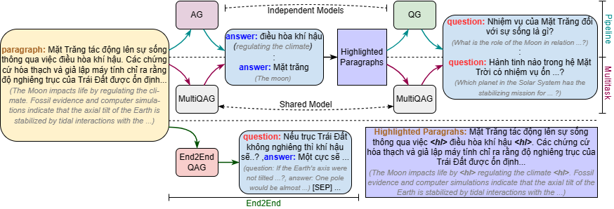

# Hệ thống Sinh Câu Hỏi Trắc Nghiệm Tiếng Việt Tự Động

Đồ án ứng dụng mô hình ngôn ngữ lớn (PLM + LLM) vào bài toán sinh câu hỏi trắc nghiệm (Multiple Choice Question Generation) cho văn bản tiếng Việt.

Pipeline gồm 2 giai đoạn:

```
Đoạn văn tiếng Việt
        │
        ▼  Stage 1 – ViQAG (ViT5 fine-tuned)
        ├─ AE: "extract answers: ..."    →  đáp án ứng viên
        └─ QG: "generate question: ..."  →  câu hỏi
        │
        ▼  Stage 2 – LLM ( Ollama)
        └─ Sinh 3–4 đáp án sai (distractors) cho mỗi câu
        │
        ▼  Build MCQ
        └─ 4 lựa chọn A / B / C / D  ·  xáo ngẫu nhiên
        │
        ▼  Streamlit Web App  (demo_mcq/)
        └─ Chỉnh sửa · Lưu lịch sử · Xuất Word / PDF
```

> **Nghiên cứu nền tảng:**
> Pham, Q.-H., Le, H.-L., Dang, N. M., Tran, K. T., Tran-Tien, M., Dang, V.-H., Vu, H.-T., Nguyen, M.-T., & Phan, X.-H. (2024).
> *Towards Vietnamese Question and Answer Generation: An Empirical Study.*
> ACM Transactions on Asian and Low-Resource Language Information Processing.
> https://doi.org/10.1145/3675781

> **Codebase gốc (ViQAG):** https://github.com/Shaun-le/ViQAG
> Repo này kế thừa và mở rộng phần demo với distractor generation và giao diện Streamlit.

---

## 📦 Cấu trúc repo

```
ViT5/
├── plms/                    # Thư viện core (kế thừa từ ViQAG)
│   ├── language_model.py       ← class TransformersQG (QG / QAG / AE)
│   ├── inference_api.py        ← HF Inference API wrapper
│   ├── trainer.py              ← training loop
│   ├── compute_metrics.py      ← BLEU, ROUGE, BERTScore
│   ├── data.py
│   └── utils.py
├── llm/                     # LLM-based generation
│   ├── generate.py
│   └── trainer.py
├── data/                    # Tiện ích xử lý dữ liệu & JSONL mẫu
│   ├── qg_data.py
│   ├── qag_data.py
│   ├── instructions.txt
│   └── examples/
├── assets/
├── train.py                 # Script fine-tuning PLM
├── evaluation.py            # Script đánh giá (BLEU / ROUGE / BERTScore)
├── requirements.txt
│
└── demo_mcq/                # ★ Web App Demo
    ├── app.py                  ← Streamlit UI (entry point)
    ├── generator.py            ← Stage 1: ViQAG pipeline wrapper
    ├── distractor.py           ← Stage 2: LLM distractor generator
    ├── export_utils.py         ← Xuất đề ra Word (.docx) / PDF
    ├── .env                    ← API keys (tạo từ .env.example)
    ├── .env.example
    └── requirements.txt
```

---

## 🚀 Chạy Web App Demo

### 1. Clone repo

```bash
git clone https://github.com/phamvanso/Chuy-n-HTTT.git
cd Chuy-n-HTTT/demo_mcq
```

### 2. Cài thư viện

```bash
# PyTorch CPU (đủ cho demo, không cần GPU)
pip install torch --index-url https://download.pytorch.org/whl/cpu

# Thư viện demo
pip install -r requirements.txt
```

<details>
<summary>requirements.txt (demo_mcq)</summary>

```
streamlit>=1.32.0
python-dotenv>=1.0.0
torch>=2.1.0
transformers>=4.38.0
sentencepiece>=0.1.99
accelerate>=0.27.0
google-genai>=1.0.0
openai>=1.12.0
python-docx>=1.1.0
fpdf2>=2.7.9
```
</details>

### 3. Tạo file `.env`

```bash
copy .env.example .env   # Windows
cp .env.example .env     # Mac / Linux
```

Điền vào `.env`:

### 4. Khởi động

```bash
streamlit run app.py
```

Truy cập: **http://localhost:8501**

### Tính năng demo

| Tính năng | Mô tả |
|---|---|
| Sinh MCQ từ văn bản | Nhập đoạn văn → tự động ra câu hỏi trắc nghiệm 4 lựa chọn |
| Số câu tuỳ chỉnh | Chọn 1–20 câu |
| Độ khó distractor | Dễ / Trung bình / Khó |
| Chỉnh sửa nội tuyến | Sửa câu hỏi, đáp án trực tiếp trên UI |
| Lịch sử | Lưu lại 10 đề gần nhất trong session |
| Xuất Word (.docx) | Đề + bảng đáp án, có highlight đáp án đúng |
| Xuất PDF | Font hỗ trợ Unicode tiếng Việt |
| Fallback | Nếu Gemini lỗi, vẫn hiển thị câu hỏi với placeholder |

---

##  Mô hình sử dụng

### Stage 1 – ViT5 (Question & Answer Generation)

Model chính: [`shnl/vit5-vinewsqa-qg-ae`](https://huggingface.co/shnl/vit5-vinewsqa-qg-ae)
— Multitask model (QG + AE cùng 1 model), fine-tuned trên ViNewsQA.

**Kiến trúc:** ViT5 là biến thể T5 cho tiếng Việt, được phát triển bởi VietAI [[2]](#references).
Input sử dụng prefix để phân biệt subtask:

```
# Answer Extraction
"extract answers: {context_before} <hl> {sentence} <hl> {context_after}"

# Question Generation
"generate question: {context_before} <hl> {answer} <hl> {context_after}"
```
### Stage 2 – LLM (Distractor Generation)
Mặc định dùng Ollama (local)

---

## 📐 Công thức toán học

### Question–Answer Generation (QAG)

**Question–Answer Generation (QAG)** được mô hình hóa như một **bài toán sinh văn bản (text generation)** bằng cách sử dụng **Pretrained Language Models (PLMs)** hoặc **Large Language Models (LLMs)**.

Cho một đoạn ngữ cảnh:

$C = \{s_{1}, s_{2}, ..., s_{n}\}$

trong đó $C  gồm $\textit{n}$ câu. Nhiệm vụ của mô hình QAG là **tự động sinh ra các cặp câu hỏi – câu trả lời tự nhiên** từ đoạn ngữ cảnh này:

$\mathcal{Q}$ = $\{(q_{1}, a_{1}), (q_{2}, a_{2}), ...\}$.

Trong đó:

* $(q_{i})$ là **câu hỏi**
* $(a_{i})$ là **câu trả lời tương ứng**

Về mặt hình thức, bài toán QAG được biểu diễn như **một quá trình sinh có điều kiện**:

$\mathcal{Q} = f(Q|C, \theta)$
Trong đó:

* $C$: đoạn ngữ cảnh đầu vào
* $Q$: tập các cặp **Question–Answer (QA)** chuẩn trong dữ liệu huấn luyện
* $f()$: mô hình sinh văn bản, thường là **encoder–decoder** hoặc **generative language model**
* $\theta$: tập **tham số của mô hình**

Các tham số $\theta$ được học trong quá trình huấn luyện bằng cách sử dụng các **PLMs dạng encoder–decoder (ví dụ: T5, BART, ViT5)** hoặc **LLMs** để tạo ra các cặp **QA** phù hợp với ngữ cảnh đầu vào.

---


<figure>
  <p align="center">
    
  </p>
  <p align="center"><strong>Fig. 1 – Tổng quan hệ thống fine-tuning và instruction-tuning cho QAG (Pham et al., 2024).</strong></p>
</figure>

---

## Sử dụng

### Cài đặt

```bash
git clone https://github.com/phamvanso/Chuy-n-HTTT.git
cd Chuy-n-HTTT/demo_mcq
pip install -r requirements.txt
```
## Tạo câu hỏi và đáp án
### Multitask model
- **Sinh QAG với Multitask và End2End Models:** Các mô hình **Multitask** được huấn luyện để vừa **sinh câu trả lời** vừa **sinh câu hỏi**, có khả năng **sinh trực tiếp các cặp câu hỏi – câu trả lời** cùng lúc.Và sử dụng **một mô hình duy nhất**, nên chỉ cần truyền tham số ```model``` là đủ.

```python
from plms.language_model import TransformersQG
model = TransformersQG(model='shnl/vit5-vinewsqa-qg-ae')

input = 'Lê Lợi sinh ra trong một gia đình hào trưởng tại Thanh Hóa, trưởng thành trong thời kỳ Nhà Minh đô hộ nước Việt.' \
        'Thời bấy giờ có nhiều cuộc khởi nghĩa của người Việt nổ ra chống lại quân Minh nhưng đều thất bại.' \
        'Năm 1418, Lê Lợi tổ chức cuộc khởi nghĩa Lam Sơn với lực lượng ban đầu chỉ khoảng vài nghìn người.' \
        'Thời gian đầu ông hoạt động ở vùng thượng du Thanh Hóa, quân Minh đã huy động lực lượng tới hàng vạn quân để đàn áp,' \
        'nhưng bằng chiến thuật trốn tránh hoặc sử dụng chiến thuật phục kích và hòa hoãn, nghĩa quân Lam Sơn đã dần lớn mạnh.'

qa = model.generate_qa(input)

print(qa)

#[
#  ('Lê Lợi sinh ra trong hoàn cảnh nào?', 'một gia đình hào trưởng'),
#  ('Lực lượng ban đầu của Lê Lợi là bao nhiêu?', 'khoảng vài nghìn người'),
#  ('Quân Minh đã huy động lực lượng tới bao nhiêu quân để đàn áp?', 'hàng vạn quân')
#]
```
---
 m\
## ⚙️ Huấn luyện mô hình
### Demo Model (demo_mcq)

Phần **demo** trong thư mục `demo_mcq` sử dụng model:

`shnl/vit5-vinewsqa-qg-ae`

Đây là phiên bản đã được **fine-tuning từ model gốc** `VietAI/vit5-base` bằng phương pháp **Multitask Learning** để thực hiện hai nhiệm vụ:

- **Answer Extraction (AE)**: trích xuất các đáp án tiềm năng từ đoạn văn  
- **Question Generation (QG)**: sinh câu hỏi từ đoạn văn và đáp án

---

#### 1. Phương pháp Fine-tuning

Dự án sử dụng **Multitask Learning** để huấn luyện **một model duy nhất** thực hiện đồng thời hai nhiệm vụ AE và QG.

Model phân biệt nhiệm vụ thông qua **prefix** được thêm vào đầu input:

| Task | Input Format |
|-----|-----|
| **Answer Extraction (AE)** | `extract answers: <context>` |
| **Question Generation (QG)** | `generate question: <context> <hl> <answer> <hl>` |

Trong đó `<hl>` dùng để **highlight đáp án trong ngữ cảnh**.

---

#### 2. Training Dataset

Model được fine-tune trên **ViNewsQA dataset**.

Dữ liệu được chuyển sang định dạng `.jsonl` bằng các script trong thư mục:
data/
├── qg_data.py
└── qag_data.py

# Multitask (QG + AE cùng lúc)
python train.py fine-tuning \
    --model 'VietAI/vit5-base' \
    --dataset_path 'shnl/qg-example'

<figure>
  <p align="center">
    
  </p>
  <p align="center"><strong>Fig. 2 – Các phương pháp fine-tuning: Pipeline, Multitask, End2End (Pham et al., 2024).</strong></p>
</figure>

### Đánh giá

```bash
python evaluation.py evaluate --result_path 'result.json'
```

Các metric được tính: BLEU-4, ROUGE-L, BERTScore (F1).

---

## 🛠️ Xử lý lỗi thường gặp

| Lỗi | Nguyên nhân | Cách xử lý |
|---|---|---|
| `CUDA out of memory` | GPU không đủ VRAM | Thêm `device='cpu'` hoặc giảm `MAX_INPUT_LEN` |
| `Token length exceeded` | Context quá dài | Rút ngắn dưới 400 từ |
| `JSONDecodeError` (distractor) | LLM trả về format lạ | Đã auto-retry trong `distractor.py` |
| `429 RESOURCE_EXHAUSTED` | LLM rate limit (Gemini free) | Đã auto-retry với exponential backoff |
| Câu hỏi ra tiếng Anh | Sai model | Dùng model fine-tuned tiếng Việt (xem bảng trên) |
| PDF lỗi font `Đ`, `ắ`, `ộ`… | Helvetica không hỗ trợ Unicode | `export_utils.py` tự tìm font TTF hệ thống (Arial, DejaVu) |
| `label got an empty value` (Streamlit) | `st.checkbox("")` | Đã sửa thành label ẩn có nội dung |

---

## 📚 References

<a id="references"></a>

**[1]** Pham, Q.-H., Le, H.-L., Dang, N. M., Tran, K. T., Tran-Tien, M., Dang, V.-H., Vu, H.-T., Nguyen, M.-T., & Phan, X.-H. (2024). *Towards Vietnamese Question and Answer Generation: An Empirical Study.* ACM Transactions on Asian and Low-Resource Language Information Processing. https://doi.org/10.1145/3675781

**[2]** Phan, L. T., Tran, H., Nguyen, H., & Trinh, T. H. (2022). *ViT5: Pretrained Text-to-Text Transformer for Vietnamese Language Generation.* Proceedings of NAACL-HLT 2022 (Student Research Workshop). https://aclanthology.org/2022.naacl-srw.18

**[3]** Raffel, C., Shazeer, N., Roberts, A., Lee, K., Narang, S., Matena, M., Zhou, Y., Li, W., & Liu, P. J. (2020). *Exploring the Limits of Transfer Learning with a Unified Text-to-Text Transformer.* Journal of Machine Learning Research, 21(140), 1–67. https://jmlr.org/papers/v21/20-1307.html

**[4]** Nguyen, K., Nguyen, V. D., Nguyen, A. G.-T., & Nguyen, N. L.-T. (2020). *A Vietnamese Dataset for Evaluating Machine Reading Comprehension (ViQuAD).* Proceedings of COLING 2020. https://aclanthology.org/2020.coling-main.233

**[5]** Wolf, T., Debut, L., Sanh, V., Chaumond, J., Delangue, C., Moi, A., … Brew, J. (2020). *Transformers: State-of-the-Art Natural Language Processing.* Proceedings of EMNLP 2020 (System Demonstrations). https://aclanthology.org/2020.emnlp-demos.6

**[6]** Google DeepMind. (2024). *Gemini: A Family of Highly Capable Multimodal Models.* https://deepmind.google/technologies/gemini/

**[7]** Streamlit Inc. (2024). *Streamlit – A faster way to build and share data apps.* https://streamlit.io

**[8]** ViQAG original codebase: https://github.com/Shaun-le/ViQAG

**[9]** `shnl/vit5-vinewsqa-qg-ae` model: https://huggingface.co/shnl/vit5-vinewsqa-qg-ae

**[10]** `VietAI/vit5-base` pretrained model: https://huggingface.co/VietAI/vit5-base

@article{pham2024towards,
  title     = {Towards Vietnamese Question and Answer Generation: An Empirical Study},
  author    = {Pham, Quoc-Hung and Le, Huu-Loi and Dang Nhat, Minh and Tran T, Khang
               and Tran-Tien, Manh and Dang, Viet-Hung and Vu, Huy-The
               and Nguyen, Minh-Tien and Phan, Xuan-Hieu},
  journal   = {ACM Transactions on Asian and Low-Resource Language Information Processing},
  year      = {2024},
  publisher = {ACM New York, NY},
  doi       = {10.1145/3675781}
}
```

